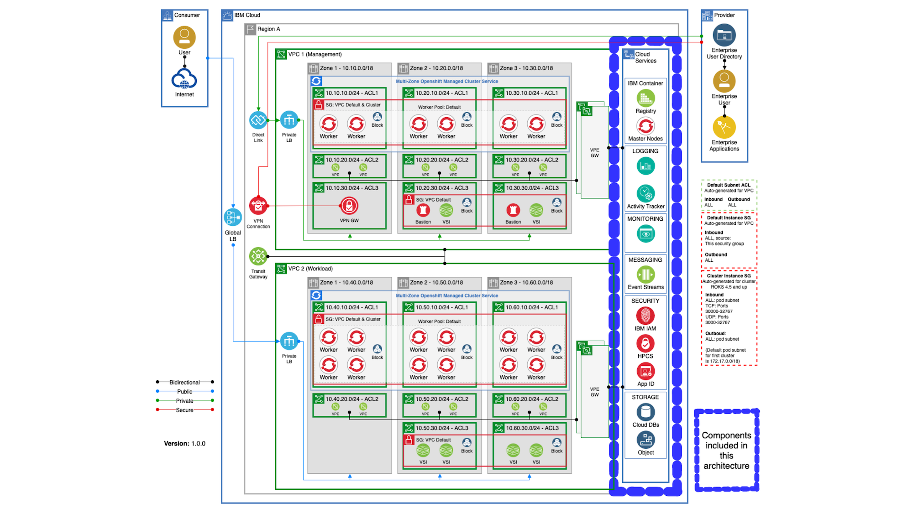

# IBM Cloud Reference Architecture

This reference architecture is a package of modular Terraform automation that can be configured and run in an IBM Cloud account. Read the instructions before configuring a schematics workspace.

## MZR Common Services

Single Region Common Services with IAM and Hyperprotect

The following diagram gives an overview of the IBM Cloud architecture topology and the components that will be configured by the Terraform automation.



## Prepare Git Repo

The following steps will guide you through the creation of a Schematics Workspace in IBM Cloud, before you get started please read the important comment below about IBM Cloud API keys.

> #### Sensitive variable values
>
> - NEVER save API keys in `variables.tf` file
> - NEVER push any API keys or senstive data to a git repository
>
>  *Use Terraform Environment Variables if locally testing* Read more [here](https://www.terraform.io/docs/language/values/variables.html#environment-variables)

## Prepare Git Repository and Configure IBM Schematics

1. If you are reading the README.MD file then you have received a download package of terraform modules. Follow these instructions to provision this refernece architecture in IBM Cloud using the Schematics Terraform as a Service capability.

2. Create an empty git repo in your source code management platform (Git Hub Enterprise, GitLab). This will be used to store your downloaded terraform code.
3. Once the new repository has been initialised,  navigate to the folder where this terraform automation content has been unzipped.
4. Follow you git providers instructions for adding an existing folder to a git repository eg. `git init`.

3. Push the Terraform into your repository

```
git add .
git commit -m "initial release"
git push
```

4. Now you have the terraform modules in a Git repository we need to configure IBM Cloud Schematics to run the terraform from this repository.
5. Create a Resource Group or use the `default` resource group. This resource group will be associated with the Schematics workspace [Create a Resource Group](https://cloud.ibm.com/docs/account?topic=account-rgs)
6. Login into IBM Cloud account and navigate to **Schematics** from the Within the IBM Cloud Console create an IBM Cloud Schematics Workspace and select the Resource Group you created earlier or select the `default` one.
7. Within the Settings view of the workspace add the URL to the Git Repository and add the Personal Access Token from your git account. This will enable Schematics to read the content of the Git Repository.
8. Select `terraform_v0.13` version
9. Click **Save Template Information**

## Apply and Run the Schematics Workspace

1. Once the Workspace has been prepare you can now modify the **Variables** in the `Settings` view.
2. Configure the variables for your envrionment. In the section **Terraform Modules** there is a link to each module `README.MD` file. This will document the varibles required to run the terraform automation.
3. The common ones to configure are `resource_group_name` , `region`, `ibmcloud_api_key` if you add a `name_prefix` and leave the cloud service names empty the terraform will create a common name for he service instance. Click on the `Edit` menu to open the dialog to edit the values.
4. Once the variables have been configured click `Generate Plan` this will validate the configuration.
5. Once the `Generate Plan` has completed click on `Apply Plan` to kick off Schematics to apply the terraform modules to you IBM Cloud Account. 
6. Cick on the View Logs in the `Activity` menu to see the progress of your automation. 

## Terraform Modules

For more documentation on the specific features of the terraform modules included in this reference architecture use the referenced links below

- [docs/key-protect.md](docs/key-protect.md)
- [docs/ibm-resource-group.md](docs/ibm-resource-group.md)
- [docs/ibm-object-storage.md](docs/ibm-object-storage.md)
- [docs/ibm-activity-tracker.md](docs/ibm-activity-tracker.md)
- [docs/sysdig.md](docs/sysdig.md)
- [docs/logdna.md](docs/logdna.md)
- [docs/ibm-access-group.md](docs/ibm-access-group.md)
- [docs/hpcs.md](docs/hpcs.md)
- [docs/ibm-resource-group.md](docs/ibm-resource-group.md)


The complete module catalog can be found here [Terraform Module Catalog](https://github.com/cloud-native-toolkit/garage-terraform-modules/blob/main/MODULES.md)


## Summary

For more information on IBM Cloud , IBM Schematics and Reference Architectures please reference these links below :


- [IBM Cloud Documentations](https://cloud.ibm.com/docs)
- [IBM Cloud Schematics CLI](https://cloud.ibm.com/docs/schematics?topic=schematics-schematics-cli-reference)

